###jQuery的基本使用

####jQuery的入口函数
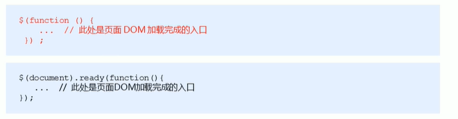

####jQuery对象和DOM对象

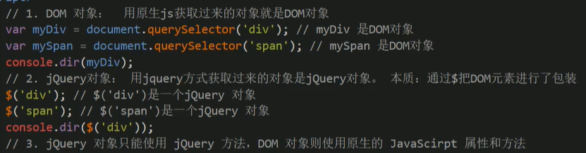

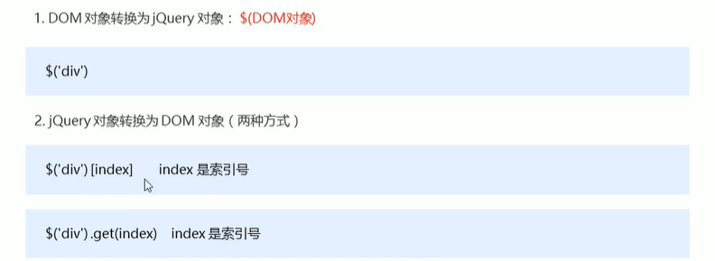

###jQuery选择器
####jQuery基础选择器

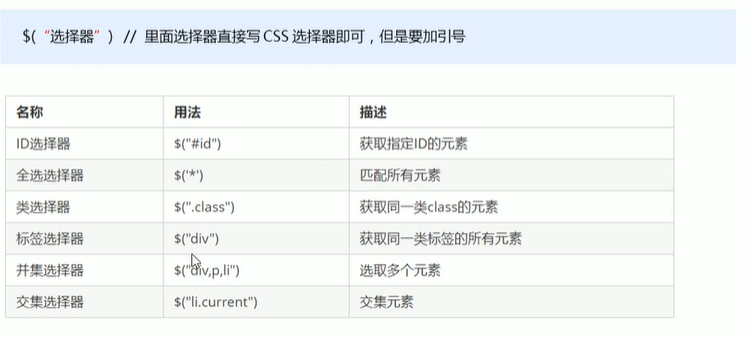

####jQuery设置样式
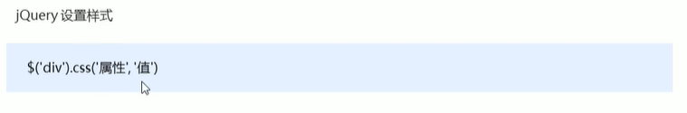

####jQuery筛选选择器
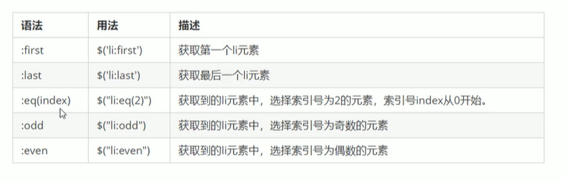

####jQuery筛选方法
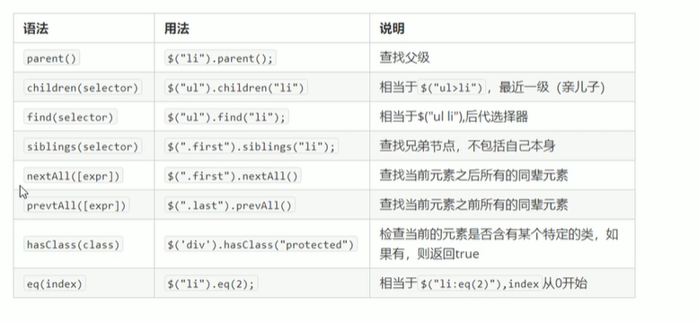

####jQuery链式编程

###jQuery样式操作

####操作css
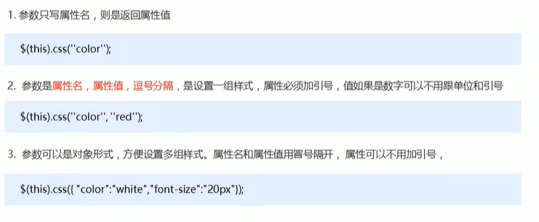

####设置类样式
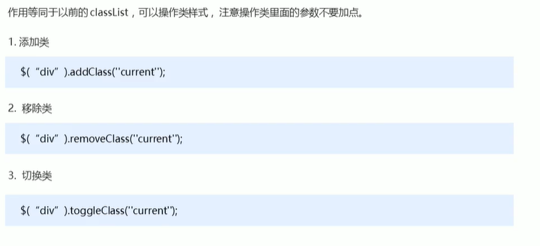
其中切换是指有则去掉，没则加上

###jQuery效果
####显示隐藏
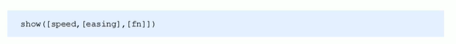
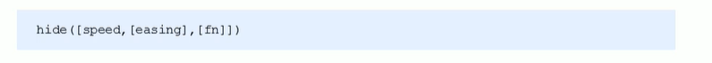

####事件切换
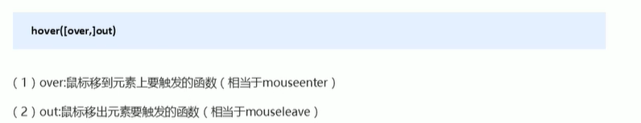

####自定义动画
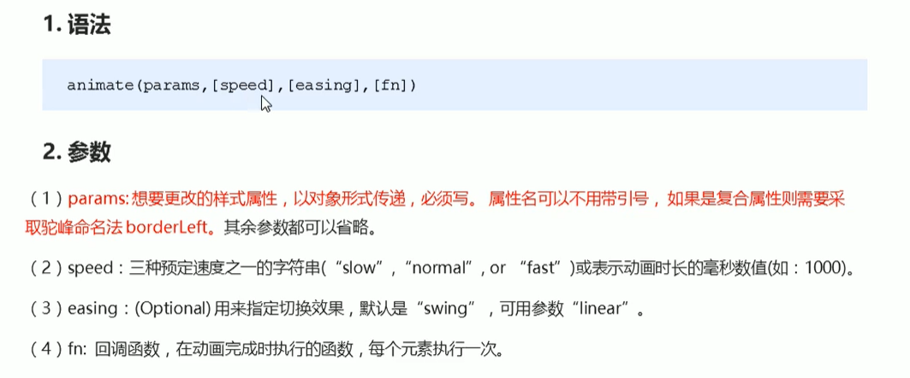

###jQuery属性操作
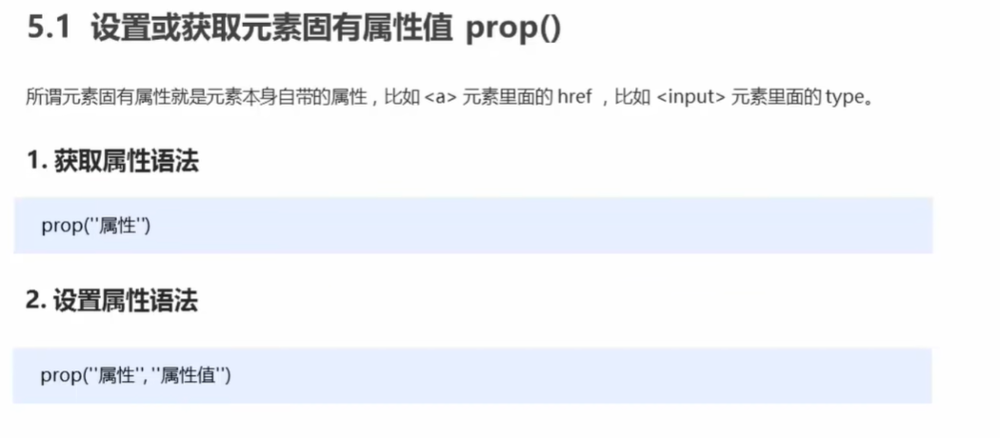

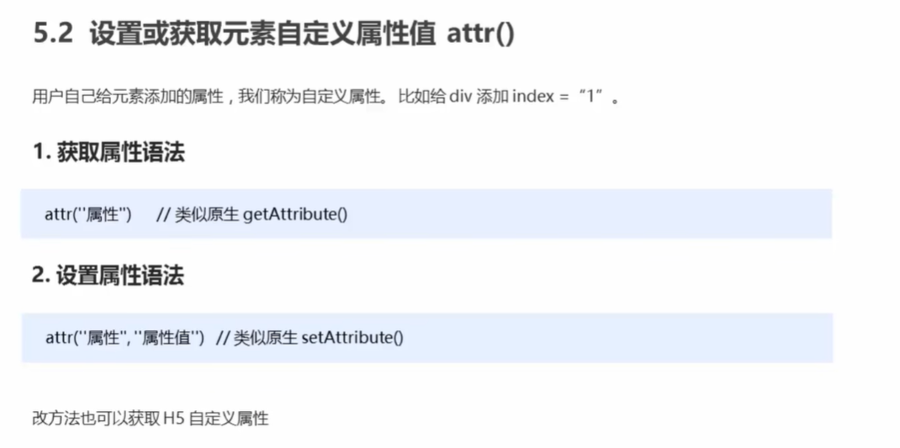

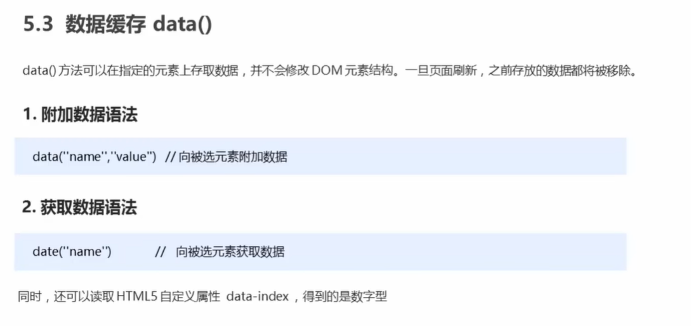

###jQuery内容文本值

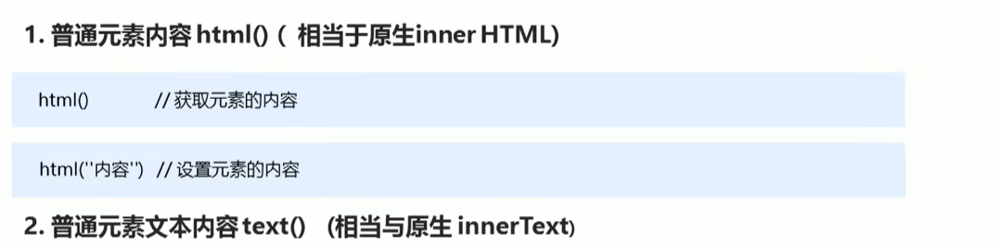

###jQuery属性操作

####遍历元素

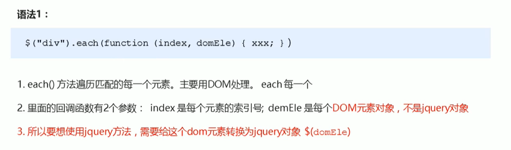

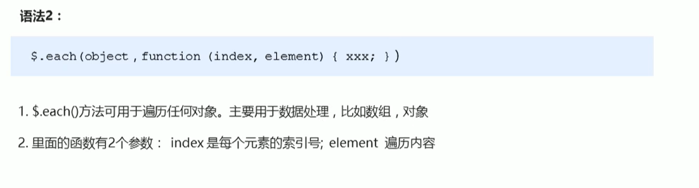

####创建元素

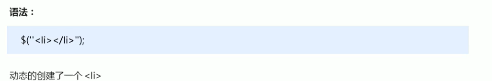

####添加元素

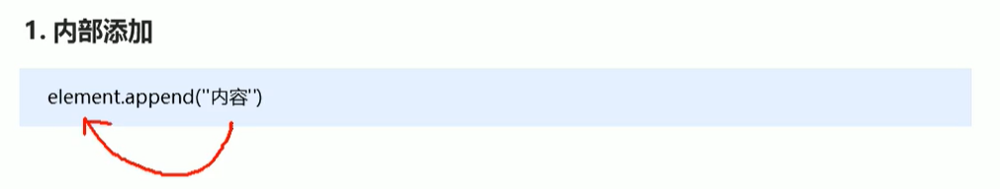

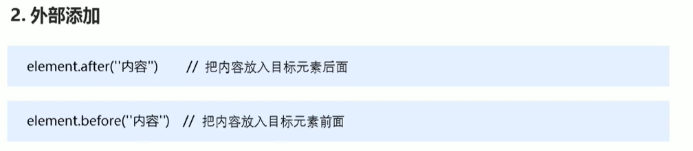 

内部添加元素后两者是父子关系，外部添加元素后两者是兄弟关系

####删除元素

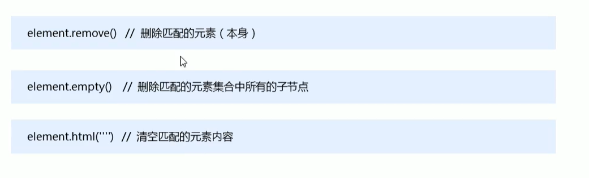

###jQuery尺寸、位置操作

####jQuery尺寸

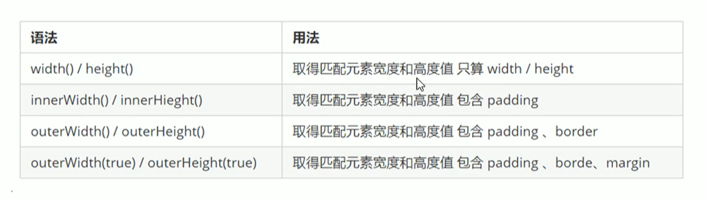

####jQuery位置

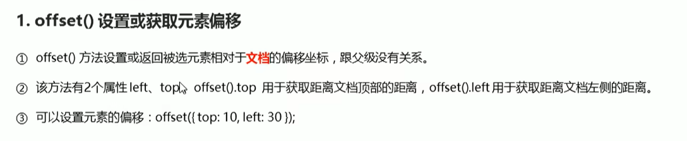

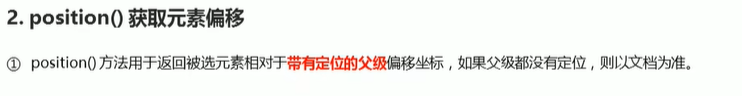

###jQuery事件处理
####jQuery事件绑定

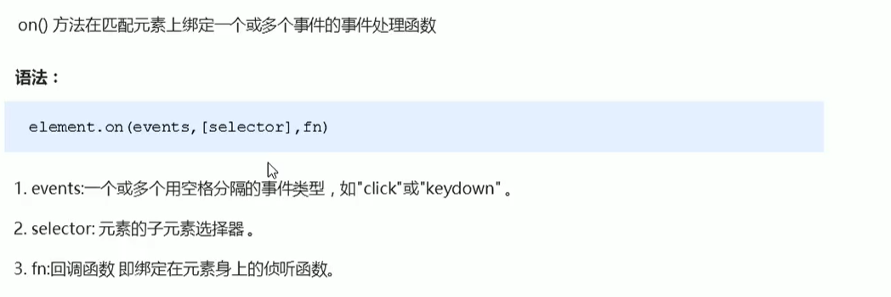

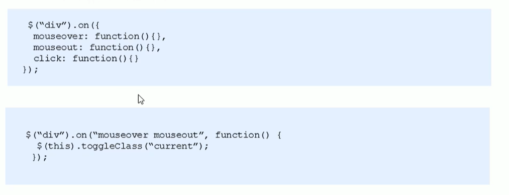

####jQuery事件移除

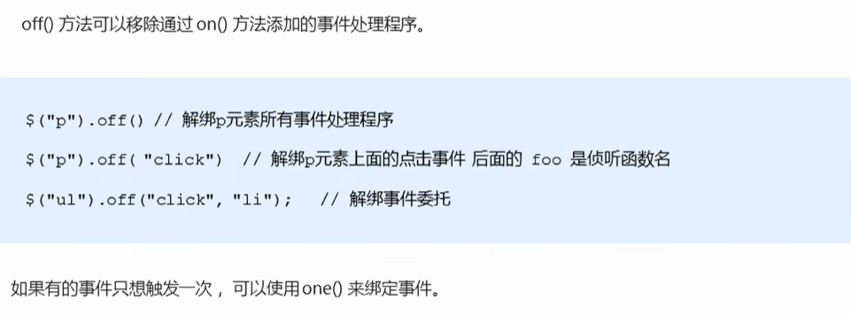

####jQuery自动触发事件

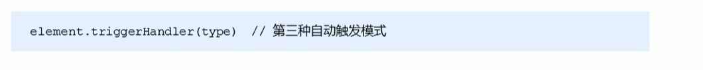

###jQuery事件对象

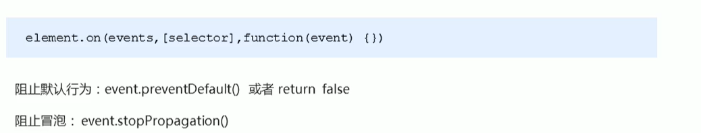

###jQuery拷贝对象

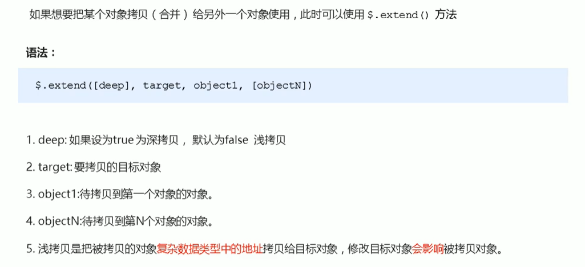
会覆盖target原来的数据

###jQuery多库共存

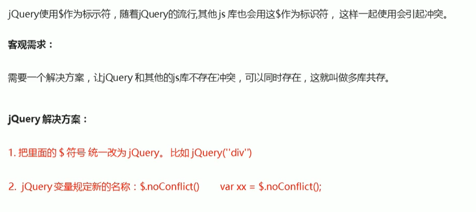

###jQuery插件

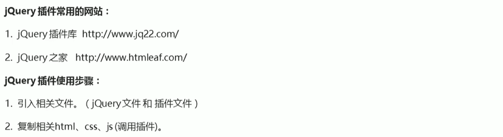