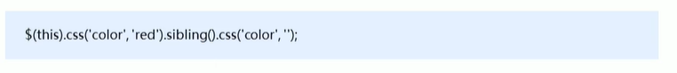
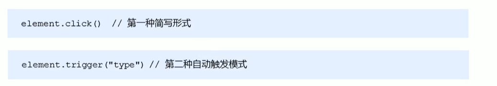

###jQuery的基本使用

####jQuery的入口函数

####jQuery对象和DOM对象

###jQuery选择器
####jQuery基础选择器

####jQuery设置样式

####jQuery筛选选择器

####jQuery筛选方法

####jQuery链式编程

###jQuery样式操作

####操作css

####设置类样式

其中切换是指有则去掉，没则加上

###jQuery效果
####显示隐藏

####事件切换

####自定义动画

###jQuery属性操作

###jQuery内容文本值

###jQuery属性操作

####遍历元素

####创建元素

####添加元素

 

内部添加元素后两者是父子关系，外部添加元素后两者是兄弟关系

####删除元素

###jQuery尺寸、位置操作

####jQuery尺寸

####jQuery位置

###jQuery事件处理
####jQuery事件绑定

####jQuery事件移除

####jQuery自动触发事件

###jQuery事件对象

###jQuery拷贝对象

会覆盖target原来的数据

###jQuery多库共存

###jQuery插件

